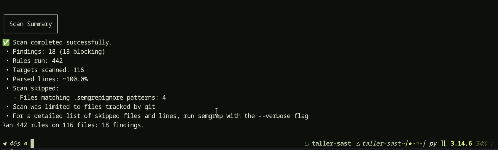
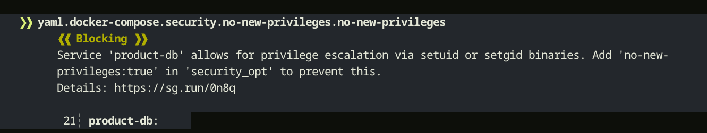
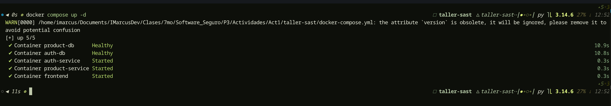
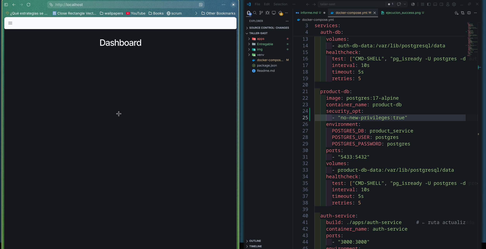

# Marcos Escobar

Se ejecutó el docker-compose en la raíz del proyecto y se detectó un único error bloqueante para el build y la ejecución del proyecto. Se trataba de un import incorrecto en el frontend, en el archivo [AuthContext.tsx](../apps/frontend/src/contexts/AuthContext.tsx), que importaba `refresh as apiRefresh` sin llegar a usarlo. Al eliminar ese import la ejecución avanzó a la siguiente etapa.

Después existía un error de versiones de Node, donde una dependencia necesitaba una versión mayor de Node. Para corregirlo cambiamos la versión 18 del [dockerfile](../apps/frontend/Dockerfile) a una versión superior, Node 22.

Posteriormente se realizó la ejecución en local de semgrep, donde se encontraron los siguientes resultados:


Luego se eligió uno de los errores de la lista identificada por semgrep. El error escogido fue el siguiente:
    ❯❱ yaml.docker-compose.security.no-new-privileges.no-new-privileges
          ❰❰ Blocking ❱❱
          Service 'product-db' allows for privilege escalation via setuid or setgid binaries. Add 'no-new-
          privileges:true' in 'security_opt' to prevent this.                                             
          Details: https://sg.run/0n8q                                                                    
                                                                                                          
           21┆ product-db:



Esta vulnerabilidad corresponde a la categoría **A02:2025 - Security Misconfiguration** del OWASP Top 10 2025, ya que se origina por una configuración insegura del contenedor que permite la escalada de privilegios.

Ahora, para la corrección del error se realizó lo siguiente:

**Código Actual:**
```yml
  product-db:
    image: postgres:17-alpine
    container_name: product-db
    environment:
      POSTGRES_DB: product_service
      POSTGRES_USER: postgres
      POSTGRES_PASSWORD: postgres
    ports:
      - "5433:5432"
    volumes:
      - product-db-data:/var/lib/postgresql/data
    healthcheck:
      test: ["CMD-SHELL", "pg_isready -U postgres -d product_service"]
      interval: 10s
      timeout: 5s
      retries: 5
```

**Código Modificado:**

```yml
  product-db:
    image: postgres:17-alpine
    container_name: product-db
    security_opt:
      - "no-new-privileges:true"
    environment:
      POSTGRES_DB: product_service
      POSTGRES_USER: postgres
      POSTGRES_PASSWORD: postgres
    ports:
      - "5433:5432"
    volumes:
      - product-db-data:/var/lib/postgresql/data
    healthcheck:
      test: ["CMD-SHELL", "pg_isready -U postgres -d product_service"]
      interval: 10s
      timeout: 5s
      retries: 5
```

Se ejecutó nuevamente el docker-compose para corroborar que la aplicación no se rompe con los cambios realizados.



Y por último se muestra que la aplicación efectivamente sigue corriendo.

